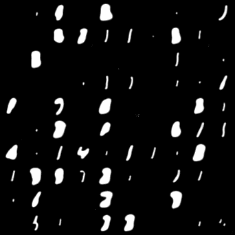
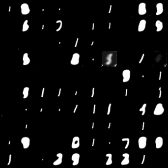
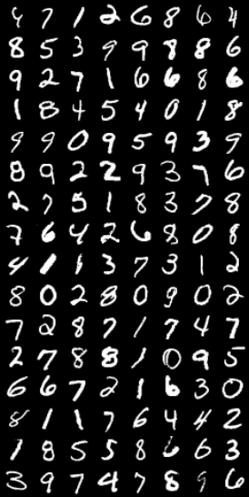

### My learning path towards understanding Diffusion Models

#### 1. Mnist DDPM & Improved DDPM

Epochs samples with posterior variance set to

${\sigma_t}^2 = \frac{1 - \bar{\alpha}_{t-1}}{1 - \bar{\alpha_{t}}}\beta_t$ , &emsp; and &emsp; ${\sigma_t}^2 = \beta_t$

 

#### 2. Mnist DDIM with Diffusion AutoEncoder

Original samples (left) and restored samples (right)

 
